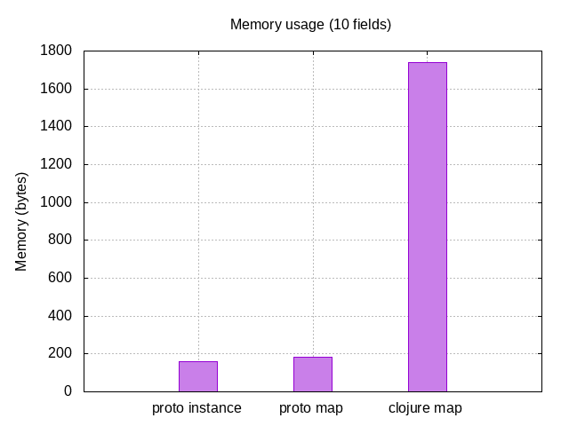
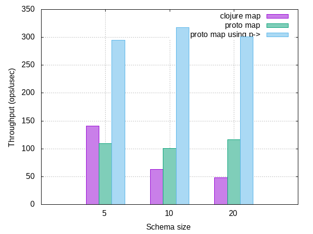
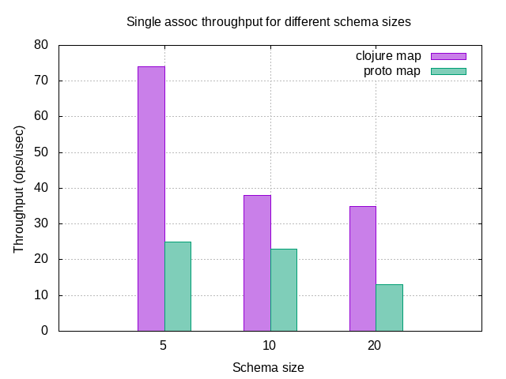
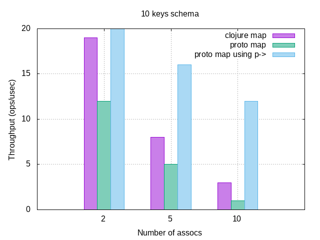
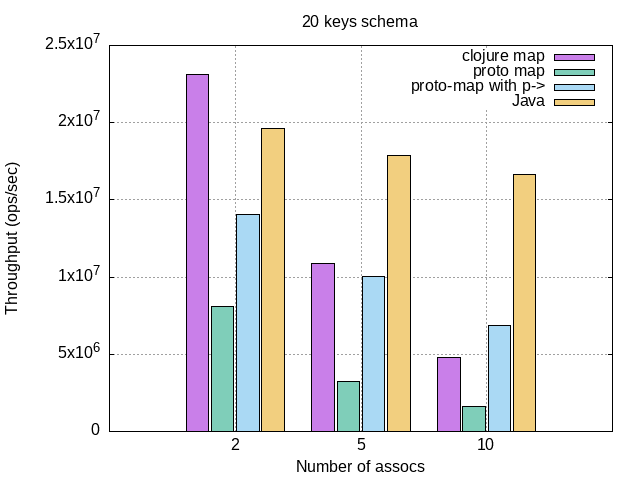

# memory efficiency

A single proto-map's memory consumption is almost identical to its corresponding Java object; the overhead is exactly 24 bytes per message.

Below is a measurement of memory consumption of a Java protobuf POJO containing 10 empty string fields, its corresponding proto-map and a corresponding Clojure map containing the same 10 key-value pairs.

# read efficiency

Reading data from proto-map (either straight via a keyword or through `clojure.core/get`) is generally faster than a regular map counterpart. To compare performance, we ran several micro-benchmarks for several schema sizes.

For each schema size, we benchmarked a proto-map containing that many string fields (so no nested messages), as well
as a corresponding Clojure map with the same shape:

Under 8 keys, Clojure uses `PersistentArrayMap` which is hard to beat. Over 8 keys, proto-maps are faster.

In addition, `pronto` comes with its own threading-macro which can further optimize access to proto-maps.
Because the threading-macro is familiar with the internal structure of proto-maps, accessing a key can become faster:

# write efficiency

The cost of a single `assoc` to a proto-map is generally higher than of its Clojure map counterpart (assuming same number of keys).

To understand why, we need to understand how a proto-map assoc's a key. Every `proto-map` holds an underlying instance of a Java protobuf POJO. It eventually
delegates all writes and reads to this Java instance. Like Clojure maps, protobuf instances are immutable. However, unlike Clojure maps which use
persistent data structures and structural sharing, in order to transform a protobuf instance, we must first transition it to a mutable builder,
do the operation on the builder and finally transition the builder back to a new protobuf instance.

This `proto->builder->proto` roundtrip is costly: to transition to a builder, protobuf copies the fields, and then copies the builder's fields again
when transitioning to the new protobuf instance.

This means that the cost of a single proto-map assoc is dominated by the cost of this roundtrip, which grows linearly with the number of fields in the schema.
This is unlike Clojure maps, where associng a key to a map is a `O(log32 n)` operation (`n` being the number of keys in the map).

## Transients

One way of achieving better write performance is by using `transients`. Proto maps can be made `transient` by calling [transient](https://clojuredocs.org/clojure.core/transient) and then persistent again via [persistent!](https://clojuredocs.org/clojure.core/persistent!), and like regular transients, transient proto maps are mutable and not thread-safe and are intended to only be used in local scopes, to perform a series of update operations.

Rather then referencing the POJO instance, transients use a `Builder` instance. This eliminates the need to transition to the builder on every update operation, and can lower GC pressure.

As mentioned previously, `pronto` comes with its own threading-macro which is able to optimize reads and writes because it is familiar with the internal
structure of the proto-map. Using this threading-macro, we can write more idiomatic code without needing to transition the proto-map to a transient and back again.
The macro essentially does this, while pipelining all `assoc`s on the transient. This also works with `assoc-in`, `update` and `update-in`.

To demonstrate, we ran a few benchmarks using several different schema sizes. For each schema size, we measured the write throughput of associng a variable
number of keys to a Clojure map, a proto-map and finally to a proto-map via the threading-macro.

