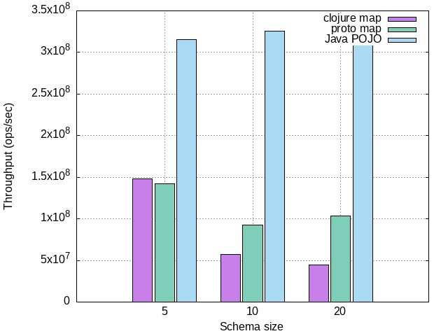
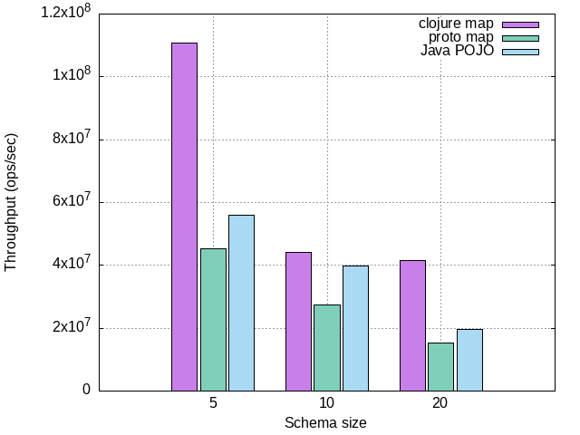
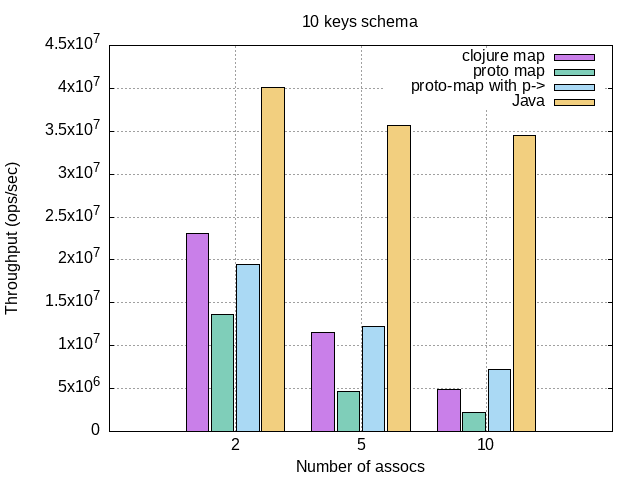

# Pronto Performance

Benchmarks were run on i7-8750H, 2.2 GHz, Linux 5.15.12-1 x86_64, JDK 17 using [JMH](https://github.com/openjdk/jmh).

# Intro
Pronto's `proto-map`s have significantly different performance characteristics than those of Clojure maps,
and it is important to outline them in order for users to both understand them going in, and to help them write performant
code and avoid pitfalls. 

To begin with, it is imporant to remember that a `proto-map` is an instance of a generated `deftype` for a particular 
schema. It is nothing more than a simple wrapper type around the Java POJO class, while also implementing various Clojure collection/map interfaces. 
All operations (`get`, `assoc`, etc) eventually delegate to the Java instance which carries the data itself.

# Memory efficiency

Since it's a simple wrapper, a single proto-map's memory consumption is almost identical to its corresponding Java object; the overhead is exactly 24 bytes per message.

Below is a measurement of memory consumption of a Java protobuf POJO containing 10 empty string fields, its corresponding proto-map and a corresponding Clojure map containing the same 10 key-value pairs.


# Read performance

Reading data from proto-map (either straight via a keyword or through `clojure.core/get`) is generally faster than a regular map counterpart. To compare performance, we ran several micro-benchmarks for several schema sizes.

For each schema size, we benchmarked:
* Reading a field from a proto-map corresponding to a flat schema of that size via `(get my-proto-map :my-field)`.
* Reading a field from a Java instance corresponding to the same schema as above, via a getter method `(.getMyField myProtobufObject)`.
* Reading a field from a Clojure map containing that number of keys via `(get my-clj-map :my-field)`.



Unsurprisingly, Java is by far the fastest as its just a static dispatch method invocation, and its performance remains constant. 
Also note that under 8 keys, proto-maps may be slightly slower than Clojure which uses the hard to beat `PersistentArrayMap`. Upwards of 8 keys, proto-maps are faster.

Don't despair though! It is possible to get pronto to be as fast as Java using `hints`. More on that [later](#using-hints-to-improve-reads). 

# Write performance

The cost of a single `assoc` to a proto-map is generally higher than of its Clojure map counterpart (assuming same number of keys).

To understand why, we need to understand how a proto-map assocs a key. Every `proto-map` holds an underlying instance of a Java protobuf POJO. It eventually
delegates all writes and reads to this Java instance. Like Clojure maps, protobuf instances are immutable. However, unlike Clojure maps which use
persistent data structures and structural sharing, in order to transform a protobuf instance, we must first transition it to a mutable builder,
do the operation on the builder and finally transition the builder back to a new protobuf instance.

This `proto->builder->proto` roundtrip is costly: to transition to a builder, protobuf copies the fields, and then copies the builder's fields again
when transitioning to the new protobuf instance.

This means that the cost of a single proto-map assoc is dominated by the cost of this roundtrip, which grows linearly with the number of fields in the schema.
This is unlike Clojure maps, where associng a key to a map is a `O(log32 n)` operation (`n` being the number of keys in the map).

To demonstrate, we benchmarked the performance of a single write to proto-maps, clojure-maps and Java POJO for different schema sizes.

For each schema size, we benchmarked:
* Setting a field of a proto-map corresponding to a flat schema of that size via `(assoc my-proto-map :my-field "my-value")`.
* Setting a field of a Java instance corresponding to the same schema as above by performing the builder roundtrip:
```clj
(let [builder (.toBuilder myObject)]
  (.setMyField builder "my-value")
  (.build builder))
```
* Setting a field of a Clojure map containing that number of keys via `(assoc my-clj-map :my-field "my-value")`.



There are a few things to note in order to interpret these results:
* Under 8 keys, Clojure maps are really fast. This is because they use the optimized `PersistentArrayMap`.
* Over 8 keys, Clojure starts using `PersistentHashMap` and its performance remains constant since this is an `O(1)` map lookup.
* Java is consistently slower than Clojure and performance degrades with schema size. This is due to the builder roundtrip discussed above.
* Proto-maps are directly correlated to Java. This makes sense since it's delegating to the Java instance. 

In Java, this can be overcome by pipelining several mutations onto a single builder, thereby incurring the round trip price only once:

```java
var builder = pojo.toBuilder();

builder.setName(...);
builder.setAge(...);
builder.setId(...);
...
var newPojo = builder.build();
```

In pronto, the fastest way of creating a new proto-map with initial values is by
supplying them in the call to `proto-map`. This will create a new builder, perform all necessary mutations on it and then copy it to a POJO instance.

```clj
;; Prefer this
(p/proto-map my-mapper People$Person :name "joe" :age 99)

;; Don't do this
(-> (p/proto-map my-mapper People$Person) (assoc :name "joe") (assoc :age 99))
```

Sometimes, we'll have an existing map we'd like to mutate. In those cases we can use `transients`.

## Transients

One way of achieving better write performance is by using `transients`. Proto maps can be made `transient` by calling [transient](https://clojuredocs.org/clojure.core/transient) and then persistent again via [persistent!](https://clojuredocs.org/clojure.core/persistent!), and like regular transients, transient proto maps are mutable and not thread-safe and are intended to only be used in local scopes, to perform a series of update operations.

Rather then referencing the POJO instance, transients use its `Builder` instance. This eliminates the need to transition to the builder on every update operation, and can lower GC pressure.

Using transients proto maps looks just like their Clojure counterparts:
```
(-> (transient my-proto-map)
    (assoc! :field_0 "hello")
    (assoc! :field_1 "world")
    persistent!)
```

You usually won't need to use transients directly, though. The same can be achieved in a cleaner way using the `p->` macro.

## A better way using the `p->` threading macro


`pronto` comes with its own threading-macro, `p->`, which is able to optimize writes using transients. Using this threading-macro we can write more idiomatic code without needing to transition the proto-map to a transient and back again.
The macro essentially does this, while pipelining all `assoc`s on the transient. This also works with `assoc-in`, `update` and `update-in`.

```clj
(require '[pronto.core :as p])

(p/p-> my-proto-map
       (assoc :field_0 "hello")
       (assoc :field_1 "world")
       (update :field_1 s/upper-case))
```

To demonstrate, we ran a few benchmarks using several different schema sizes. For each schema size, we measured the write throughput of mutating a variable
number of keys. We checked:
* associng X keys to a Clojure map.
* associng X keys to a proto-map.
* associng X keys to a proto-map, but via `p->`.
* mutating X keys on a Java protobuf builder **by performing the builder roundtrip only once**.





At around 5 keys `p->` begins to outperform Clojure. The performance gain continues to grow with the number of assocs. This makes sense, since the cost is dominated by the builder roundtrip which `p->` pays only once.

However, even with `p->` we're still way behind Java. If we want to be *that* fast, we'll have to use hints.

## Making `p->` faster with hints

The reason `p->` is slower than the Java code (even though they're both doing the builder roundtrip just once) is because the underlying proto-map transient
needs to conditionally figure out which Java setter method it needs to invoke based on the keyword argument it receives.

Put in simplified code, the internal code of the `assoc` function generated for a `Person` proto map might look roughly like this:

```clj
(case keyword-to-assoc
   :name (.setName pojo value-to-assoc)
   :age (.setAge pojo value-to-assoc)
   :id (.setId pojo value-to-assoc)
   :height (.setHeight pojo value-to-assoc)
   ...
   )
```

However, if we could know the type of a proto-map at a particular call site, we could generate far more performant code, by dispatching directly 
on the setter without having to go through the conditional above. This is where hints come in.

Hints are similar to regular Clojure type hints in concept. They can be used inside `p->` macro calls in order for it to produce better code:

```clj
(require '[pronto.core :as p])
;; import some POJO class...
(import '(protogen.generated People$Person))
;; create a mapper
(p/defmapper my-mapper [Person])
;; create some data somewhere
(def person (p/proto-map my-mapper People$Person :name "bob"))


;; use a hint when calling p->
(p/p-> (p/hint my-proto-map People$Person my-mapper)
       (assoc :age 99)
       (assoc :id 777))
```

Since we hinted our variable, `p->` is now familar with the internal structure of what it is operating on, and can bypass the conditional on the keyword, turning
the above code into direct calls to the appropriate setters:

```java
(.setAge builder 99)
(.setId builder 777)
```

To create a hint, you must pass the class as well as a mapper. Sometimes you might have a block of code comprising several `p->` expressions operating on the same map.
To avoid repeating the hint every time, you can use `with-hints` which defines a scope where hints will be used:

```clj
(p/with-hints 
  ;; hint some variables, you may have more than one 
  [(p/hint my-proto-map People$Person my-mapper)]
    ;; the hint will be applied to both p-> calls since `my-proto-map` is hinted in this scope
    (if whatever
      (p/p-> my-proto-map (update :id inc) (assoc :name "new name")
      (p/p-> my-proto-map (assoc :age 50) (assoc :id 7))))
```

To see the effect of using hints, we performed the same benchmark as above but now also using the hinted version of `p->`.


Much faster and closer to Java, and also degrades more gracefully with the number of assocs.

### Using hints to improve reads

The `p->` macro and hints can also be used to speed up reads from a map:

```clj
(p/p-> (p/hint my-proto-map People$Person my-mapper) :address :city)
```
This code will expand into direct `.getAddress()` and `.getCity()` calls rather than "dynamically dispatching" on the keywords.

To demonstrate, we performed the same benchmark as in [the reads section](#read-performance), but now also using the hinted `p->` variant:


